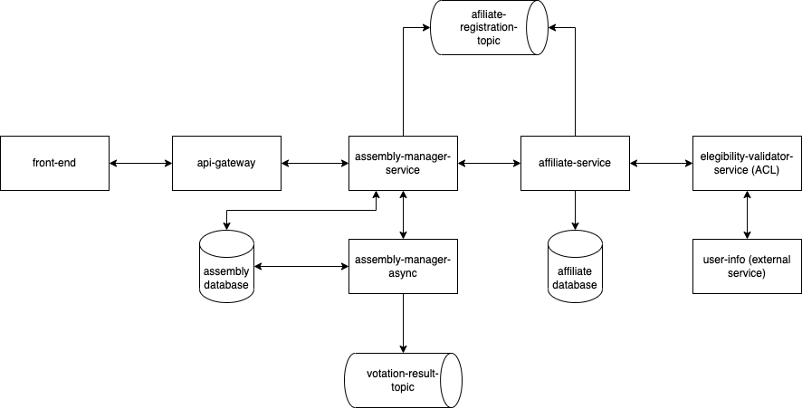
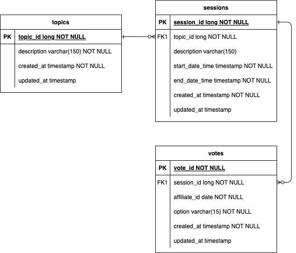

# Voting Session Manager
Desafio técnico para desenvolver uma aplicação gerenciadora de sessões de votação.

### Pendências e débitos técnicos
- Tratamento global de exceções e consequente tramento das mensagens de erro dos endpoints (o handle foi configurado, mas não está filtrando as exceções).
- Ajuste do objetos que mapeiam o body dos endpoints para conterem apenas os pâmetros exatos de entrada (importante também para o Swagger).
- Implementar testes unitários para todos os usecases (foi implementado apenas para um useca, como amostragem).
- Implementar testes de integração.
- Implementar integração com sistema externo.
- Implementar envio de evento de resultado de votação para tópico ou fila.
- Executar teste de performance.
- Implementar versionament de API.
- Melhorar o código, com a melhor utilização da assincronicidade do Webflux.
- Realizar configuração para que o banco de dados seja criado automaticamente pela aplicação.

### Como rodar a aplicacação
É necessário ter o JDK 17 ou superior configurado na máquina, o Git, o Gradle e o Dcoker para rodar o projeto.

#### Baixando o projet e suas dependências
Clone o projeto
```bash
  git clone git@github.com:davisande/voting-session-manager.git
```
Execute o Gradle na pasta do projeto
```bash
  ./gradlew clean build
```

#### Subindo a aplicacação
Considerando que já tenha o Docker configurado, acesse a pasta do projeto no terminal e execute o seguinte comando
```bash
  docker compose up -d
```
Crie um banco de dados com o seguinte nome no PostgreSQL (temporário enquanto não é feita a configuração para que o banco seja criado automaticamente)
```bash
  voting-session-manager
```
Na pasta do projeto execute o seguinte comando para subir a aplicacação
```bash
  ./gradlew bootRun
```
Acesse a URL abaixo para verificar se a aplicacação está de pé
```bash
  http://localhost:8081/actuator/health
```
Acesse o Swagger e utiliza a API
```bash
  http://localhost:8081/swagger-ui.html
```

### Solução
Uma solução melhor para o problema tratado com esta aplicacação está representada na imagem (rabisco) abaixo. A implementação foi feita em apenas um microserviço por se tratar de um desafio que foi feito às pressas. No desenho estão omitidos padrões como DLQ, Circuit Breaker, dentro outros.



### Diagrama entidade relacionamento
